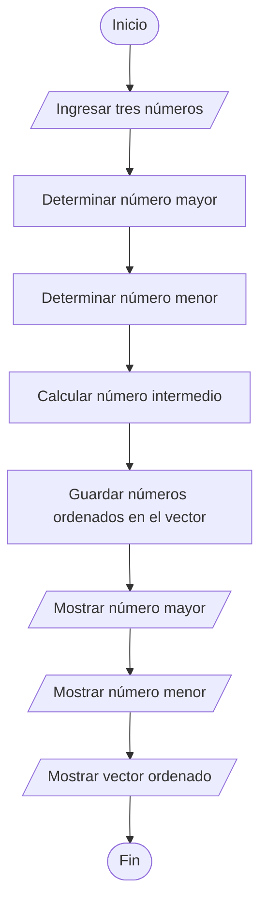

# Ejercicio 05 - Mayor, Menor y Vector Ordenado

## Enunciado

Leer tres números enteros distintos e identificar:

* El número mayor.
* El número menor.

Almacenar los tres números de manera ordenada en un vector.

Mostrar el contenido del vector.

---

# Análisis del Problema

## Entradas

| Dato | Tipo |
| ---- | ---- |
| num1 | int  |
| num2 | int  |
| num3 | int  |

---

## Proceso

1. Leer tres números enteros distintos.
2. Determinar el número mayor.
3. Determinar el número menor.
4. Calcular el número intermedio.
5. Guardar los números ordenados en un vector.
6. Mostrar el número mayor.
7. Mostrar el número menor.
8. Mostrar el vector ordenado.

---

## Salidas

| Salida          |
| --------------- |
| Número mayor    |
| Número menor    |
| Vector ordenado |

---

# Diseño de la Solución

## Secuencia Lógica

1. Inicio.
2. Leer tres números enteros distintos.
3. Inicializar mayor y menor con el primer número.
4. Comparar para encontrar el número mayor.
5. Comparar para encontrar el número menor.
6. Calcular el número intermedio.
7. Guardar menor, medio y mayor en el vector.
8. Mostrar el número mayor.
9. Mostrar el número menor.
10. Mostrar el vector ordenado.
11. Fin.

---

## Variables Utilizadas

| Variable | Tipo   | Descripción       |
| -------- | ------ | ----------------- |
| num1     | int    | Primer número     |
| num2     | int    | Segundo número    |
| num3     | int    | Tercer número     |
| mayor    | int    | Número mayor      |
| menor    | int    | Número menor      |
| medio    | int    | Número intermedio |
| vector   | int[3] | Vector ordenado   |

---

## Operadores Utilizados

| Operador | Tipo       | Uso                        |
| -------- | ---------- | -------------------------- |
| +        | Aritmético | Sumar números              |
| -        | Aritmético | Calcular número intermedio |
| >        | Relacional | Comparar números           |
| <        | Relacional | Comparar números           |
| =        | Asignación | Guardar valores            |

---

## Estructuras Utilizadas

### Vector (Arreglo)

```text
vector[3]
```

Permite almacenar los números ordenados.

### Condicional

```text
if
```

Permite determinar el número mayor y el número menor.

---

## Fórmula Utilizada

### Número Intermedio

```text
medio = (num1 + num2 + num3) - mayor - menor
```

---

# Pseudocódigo

```text
INICIO

    Definir num1 Como int
    Definir num2 Como int
    Definir num3 Como int

    Definir mayor Como int
    Definir menor Como int
    Definir medio Como int

    Definir vector[3] Como int

    Escribir "Ingrese el primer número:"
    Leer num1

    Escribir "Ingrese el segundo número:"
    Leer num2

    Escribir "Ingrese el tercer número:"
    Leer num3

    mayor ← num1
    menor ← num1

    Si num2 > mayor Entonces
        mayor ← num2
    FinSi

    Si num3 > mayor Entonces
        mayor ← num3
    FinSi

    Si num2 < menor Entonces
        menor ← num2
    FinSi

    Si num3 < menor Entonces
        menor ← num3
    FinSi

    medio ← (num1 + num2 + num3) - mayor - menor

    vector[0] ← menor
    vector[1] ← medio
    vector[2] ← mayor

    Mostrar "Mayor: ", mayor
    Mostrar "Menor: ", menor

    Mostrar "Vector ordenado: "

    Mostrar vector[0]
    Mostrar vector[1]
    Mostrar vector[2]

FIN
```

---

# Diagrama de Flujo



---

# Prueba de Escritorio

| num1 | num2 | num3 | Menor | Medio | Mayor | Vector       |
| ---- | ---- | ---- | ----- | ----- | ----- | ------------ |
| 8    | 3    | 5    | 3     | 5     | 8     | [3, 5, 8]    |
| 10   | 1    | 7    | 1     | 7     | 10    | [1, 7, 10]   |
| 15   | 20   | 12   | 12    | 15    | 20    | [12, 15, 20] |

---

# Implementación en C++

```cpp
#include <iostream>

using namespace std;

int main() {
  int num1, num2, num3;
  int mayor, menor, medio;
  int vector[3];

  cout << "Ingrese el primer numero: ";
  cin >> num1;

  cout << "Ingrese el segundo numero: ";
  cin >> num2;

  cout << "Ingrese el tercer numero: ";
  cin >> num3;

  mayor = num1;
  menor = num1;

  if (num2 > mayor)
    mayor = num2;

  if (num3 > mayor)
    mayor = num3;

  if (num2 < menor)
    menor = num2;

  if (num3 < menor)
    menor = num3;

  medio = (num1 + num2 + num3) - mayor - menor;

  vector[0] = menor;
  vector[1] = medio;
  vector[2] = mayor;

  cout << "\nMayor: " << mayor << endl;

  cout << "Menor: " << menor << endl;

  cout << "Vector ordenado: ";

  for (int i = 0; i < 3; i++) {
    cout << vector[i] << " ";
  }

  cout << endl;

  return 0;
}
```

---

# Ejemplo de Ejecución

```text
Ingrese tres numeros: 8 3 5

Mayor: 8
Menor: 3

Vector ordenado: 3 5 8
```

---

# Observaciones

* El ejercicio supone que los tres números son distintos.
* No es necesario utilizar algoritmos de ordenamiento.
* El número intermedio puede calcularse utilizando la suma total menos el mayor y el menor.
* El vector almacena los números ya ordenados.

---

# Temas Relacionados

* Variables y Tipos de Datos
* Operadores Aritméticos
* Operadores Relacionales
* Condicionales
* Arreglos (Vectores)
* Diagramas de Flujo
* Pruebas de Escritorio
