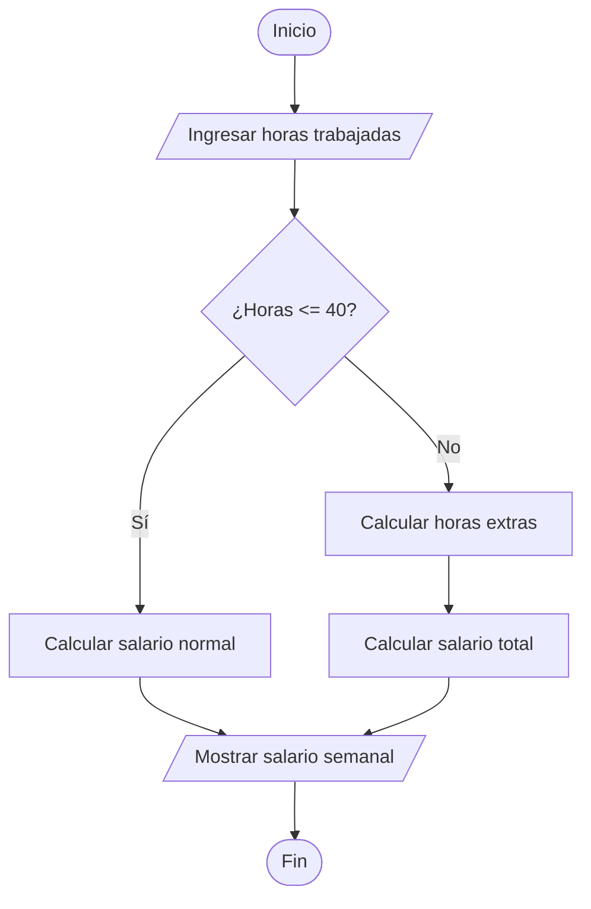

# Ejercicio 06 - Salario Semanal de un Obrero

## Enunciado

Leer la cantidad de horas trabajadas por un obrero y calcular su salario semanal:

* Hasta 40 horas → 20 Bs por hora.
* Más de 40 horas → las primeras 40 horas se pagan a 20 Bs por hora y las horas extras a 25 Bs por hora.

Mostrar el salario total.

---

# Análisis del Problema

## Entradas

| Dato  | Tipo |
| ----- | ---- |
| horas | int  |

---

## Proceso

1. Leer la cantidad de horas trabajadas.
2. Verificar si las horas son menores o iguales a 40.
3. Si son menores o iguales a 40, calcular el salario normal.
4. Si son mayores a 40, calcular las horas extras.
5. Calcular el salario total.
6. Mostrar el salario semanal.

---

## Salidas

| Salida          |
| --------------- |
| Salario semanal |

---

# Diseño de la Solución

## Secuencia Lógica

1. Inicio.
2. Solicitar las horas trabajadas.
3. Leer las horas ingresadas.
4. Verificar si las horas trabajadas son menores o iguales a 40.
5. Si la condición es verdadera, calcular salario normal.
6. Si la condición es falsa:

   * Calcular horas extras.
   * Calcular salario total.
7. Mostrar salario semanal.
8. Fin.

---

## Variables Utilizadas

| Variable    | Tipo  | Descripción                    |
| ----------- | ----- | ------------------------------ |
| horas       | int   | Horas trabajadas por el obrero |
| horas_extra | int   | Horas que exceden las 40 horas |
| salario     | float | Salario semanal calculado      |

---

## Operadores Utilizados

| Operador | Tipo       | Uso                      |
| -------- | ---------- | ------------------------ |
| *        | Aritmético | Calcular pagos           |
| +        | Aritmético | Sumar pagos              |
| -        | Aritmético | Calcular horas extras    |
| <=       | Relacional | Comparar límite de horas |
| >        | Relacional | Comparar límite de horas |
| =        | Asignación | Guardar valores          |

---

## Estructuras Utilizadas

### Condicional

```text
if - else
```

Permite determinar si existen horas extras.

---

## Fórmulas Utilizadas

### Salario Normal

```text
salario = horas * 20
```

### Horas Extras

```text
horas_extra = horas - 40
```

### Salario con Horas Extras

```text
salario =
(40 * 20)
+
(horas_extra * 25)
```

---

# Pseudocódigo

```text
INICIO

    Definir horas Como int
    Definir horas_extra Como int
    Definir salario Como float

    Escribir "Ingrese horas trabajadas:"
    Leer horas

    Si horas <= 40 Entonces

        salario ← horas * 20

    Sino

        horas_extra ← horas - 40

        salario ← (40 * 20) + (horas_extra * 25)

    FinSi

    Mostrar "Salario semanal: ", salario, " Bs"

FIN
```

---

# Diagrama de Flujo



---

# Prueba de Escritorio

| Horas | Horas Extra | Salario |
| ----- | ----------- | ------- |
| 30    | 0           | 600 Bs  |
| 40    | 0           | 800 Bs  |
| 45    | 5           | 925 Bs  |
| 50    | 10          | 1050 Bs |

### Verificación

Para 45 horas:

```text
40 × 20 = 800

5 × 25 = 125

Total = 925 Bs
```

---

# Implementación en C++

```cpp
#include <iostream>

using namespace std;

int main() {

    int horas;
    int horas_extra;

    float salario;

    cout << "Ingrese horas trabajadas: ";
    cin >> horas;

    if (horas <= 40) {

        salario = horas * 20;

    } else {

        horas_extra = horas - 40;

        salario = (40 * 20) + (horas_extra * 25);

    }

    cout << "\nSalario semanal: " << salario << " Bs" << endl;

    return 0;
}
```

---

# Ejemplo de Ejecución

```text
Ingrese horas trabajadas: 45

Salario semanal: 925 Bs
```

---

# Observaciones

* Las primeras 40 horas siempre se pagan a tarifa normal.
* Solo las horas que exceden las 40 se consideran horas extras.
* Las horas extras tienen una tarifa superior.
* Se utiliza una estructura condicional simple para determinar el cálculo correspondiente.

---

# Temas Relacionados

* Variables y Tipos de Datos
* Operadores Aritméticos
* Operadores Relacionales
* Condicionales (if - else)
* Diagramas de Flujo
* Pruebas de Escritorio
