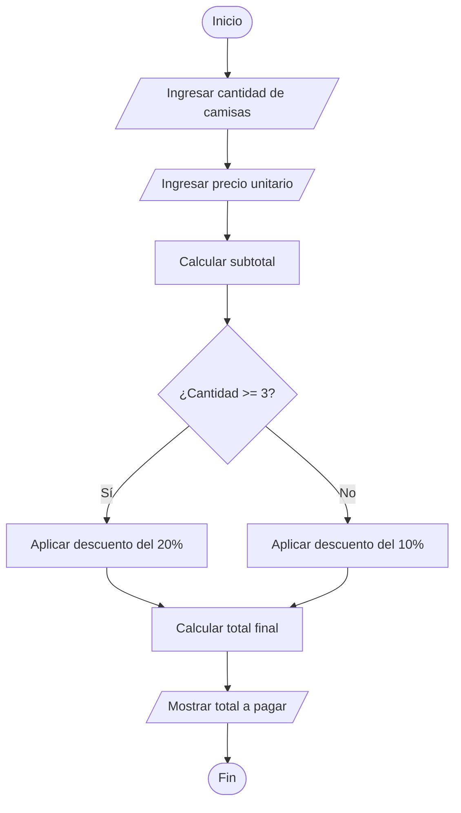

# Ejercicio 07 - Descuento en la Compra de Camisas

## Enunciado

Leer la cantidad de camisas compradas y el precio unitario.

Calcular el total a pagar aplicando:

* 20% de descuento si compra 3 o más camisas.
* 10% de descuento si compra menos de 3 camisas.

Mostrar el total final.

---

# Análisis del Problema

## Entradas

| Dato             | Tipo  |
| ---------------- | ----- |
| cantidad_camisas | int   |
| precio_unitario  | float |

---

## Proceso

1. Leer la cantidad de camisas compradas.
2. Leer el precio unitario de cada camisa.
3. Calcular el subtotal de la compra.
4. Verificar la cantidad de camisas compradas.
5. Aplicar el descuento correspondiente.
6. Calcular el total final.
7. Mostrar el total a pagar.

---

## Salidas

| Salida        |
| ------------- |
| Total a pagar |

---

# Diseño de la Solución

## Secuencia Lógica

1. Inicio.
2. Solicitar cantidad de camisas.
3. Leer cantidad de camisas.
4. Solicitar precio unitario.
5. Leer precio unitario.
6. Calcular subtotal.
7. Verificar si la cantidad de camisas es mayor o igual a 3.
8. Aplicar descuento correspondiente.
9. Calcular total final.
10. Mostrar total a pagar.
11. Fin.

---

## Variables Utilizadas

| Variable         | Tipo  | Descripción                 |
| ---------------- | ----- | --------------------------- |
| cantidad_camisas | int   | Número de camisas compradas |
| precio_unitario  | float | Precio de una camisa        |
| subtotal         | float | Total antes del descuento   |
| descuento        | float | Descuento aplicado          |
| total_pagar      | float | Total final de la compra    |

---

## Operadores Utilizados

| Operador | Tipo       | Uso                           |
| -------- | ---------- | ----------------------------- |
| *        | Aritmético | Calcular subtotal y descuento |
| -        | Aritmético | Calcular total final          |
| >=       | Relacional | Verificar cantidad de camisas |
| =        | Asignación | Guardar valores               |

---

## Estructuras Utilizadas

### Condicional

```text
if - else
```

Permite determinar el porcentaje de descuento a aplicar.

---

## Fórmulas Utilizadas

### Subtotal

```text
subtotal = cantidad_camisas * precio_unitario
```

### Descuento del 20%

```text
descuento = subtotal * 0.20
```

### Descuento del 10%

```text
descuento = subtotal * 0.10
```

### Total Final

```text
total_pagar = subtotal - descuento
```

---

# Pseudocódigo

```text
INICIO

    Definir cantidad_camisas Como int
    Definir precio_unitario Como float

    Definir subtotal Como float
    Definir descuento Como float
    Definir total_pagar Como float

    Escribir "Ingrese cantidad de camisas:"
    Leer cantidad_camisas

    Escribir "Ingrese precio unitario:"
    Leer precio_unitario

    subtotal ← cantidad_camisas * precio_unitario

    Si cantidad_camisas >= 3 Entonces

        descuento ← subtotal * 0.20

    Sino

        descuento ← subtotal * 0.10

    FinSi

    total_pagar ← subtotal - descuento

    Mostrar "Total a pagar: ", total_pagar, " Bs"

FIN
```

---

# Diagrama de Flujo



---

# Prueba de Escritorio

| Camisas | Precio Unitario | Subtotal | Descuento | Total |
| ------- | --------------- | -------- | --------- | ----- |
| 2       | 50              | 100      | 10        | 90    |
| 3       | 50              | 150      | 30        | 120   |
| 5       | 80              | 400      | 80        | 320   |
| 1       | 100             | 100      | 10        | 90    |

### Verificación

Para 5 camisas de 80 Bs:

```text
subtotal = 5 × 80

subtotal = 400

descuento = 400 × 0.20

descuento = 80

total = 400 - 80

total = 320 Bs
```

---

# Implementación en C++

```cpp
#include <iostream>

using namespace std;

int main() {

    int cantidad_camisas;

    float precio_unitario;
    float subtotal;
    float descuento;
    float total_pagar;

    cout << "Ingrese cantidad de camisas: ";
    cin >> cantidad_camisas;

    cout << "Ingrese precio unitario: ";
    cin >> precio_unitario;

    subtotal = cantidad_camisas * precio_unitario;

    if (cantidad_camisas >= 3) {

        descuento = subtotal * 0.20;

    } else {

        descuento = subtotal * 0.10;

    }

    total_pagar = subtotal - descuento;

    cout << "\nTotal a pagar: " << total_pagar << " Bs" << endl;

    return 0;
}
```

---

# Ejemplo de Ejecución

```text
Ingrese cantidad de camisas: 4
Ingrese precio unitario: 75

Total a pagar: 240 Bs
```

---

# Observaciones

* El descuento depende únicamente de la cantidad de camisas compradas.
* Primero se calcula el subtotal y luego se aplica el descuento.
* El descuento se expresa como porcentaje del subtotal.
* Se utiliza una estructura condicional simple.

---

# Temas Relacionados

* Variables y Tipos de Datos
* Operadores Aritméticos
* Operadores Relacionales
* Condicionales (if - else)
* Diagramas de Flujo
* Pruebas de Escritorio
* Porcentajes
