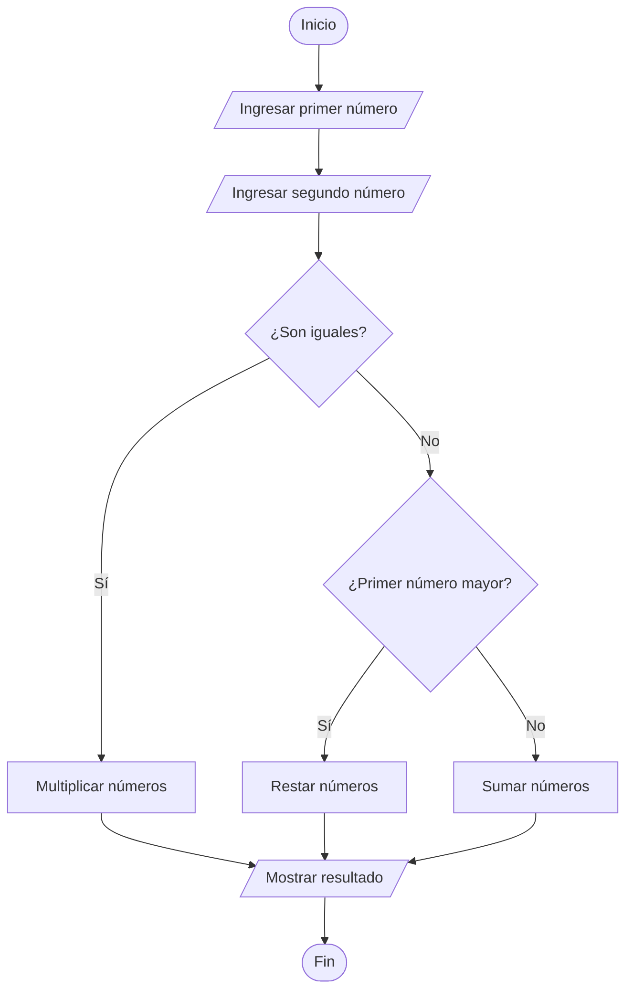

# Ejercicio 08 - Operación Según la Relación entre Dos Números

## Enunciado

Leer dos números enteros y realizar:

* Si son iguales → multiplicar.
* Si el primero es mayor → restar.
* Si el segundo es mayor → sumar.

Mostrar el resultado.

---

# Análisis del Problema

## Entradas

| Dato | Tipo |
| ---- | ---- |
| num1 | int  |
| num2 | int  |

---

## Proceso

1. Leer dos números enteros.
2. Comparar ambos números.
3. Si son iguales, multiplicarlos.
4. Si el primero es mayor que el segundo, restarlos.
5. Si el segundo es mayor que el primero, sumarlos.
6. Mostrar el resultado obtenido.

---

## Salidas

| Salida                    |
| ------------------------- |
| Resultado de la operación |

---

# Diseño de la Solución

## Secuencia Lógica

1. Inicio.
2. Solicitar el primer número.
3. Leer el primer número.
4. Solicitar el segundo número.
5. Leer el segundo número.
6. Comparar ambos números.
7. Si son iguales, multiplicarlos.
8. Si el primero es mayor, restarlos.
9. Si el segundo es mayor, sumarlos.
10. Mostrar el resultado.
11. Fin.

---

## Variables Utilizadas

| Variable  | Tipo | Descripción               |
| --------- | ---- | ------------------------- |
| num1      | int  | Primer número             |
| num2      | int  | Segundo número            |
| resultado | int  | Resultado de la operación |

---

## Operadores Utilizados

| Operador | Tipo       | Uso                            |
| -------- | ---------- | ------------------------------ |
| +        | Aritmético | Sumar números                  |
| -        | Aritmético | Restar números                 |
| *        | Aritmético | Multiplicar números            |
| ==       | Relacional | Verificar igualdad             |
| >        | Relacional | Comparar si un número es mayor |
| <        | Relacional | Comparar si un número es menor |
| =        | Asignación | Guardar resultados             |

---

## Estructuras Utilizadas

### Condicional Múltiple

```text
if - else if - else
```

Permite seleccionar la operación adecuada según la relación entre los números.

---

# Pseudocódigo

```text
INICIO

    Definir num1 Como int
    Definir num2 Como int
    Definir resultado Como int

    Escribir "Ingrese el primer número:"
    Leer num1

    Escribir "Ingrese el segundo número:"
    Leer num2

    Si num1 == num2 Entonces

        resultado ← num1 * num2

    Sino Si num1 > num2 Entonces

        resultado ← num1 - num2

    Sino

        resultado ← num1 + num2

    FinSi

    Mostrar "Resultado: ", resultado

FIN
```

---

# Diagrama de Flujo



---

# Prueba de Escritorio

| num1 | num2 | Operación | Resultado |
| ---- | ---- | --------- | --------- |
| 5    | 5    | 5 × 5     | 25        |
| 10   | 4    | 10 - 4    | 6         |
| 3    | 8    | 3 + 8     | 11        |
| 20   | 7    | 20 - 7    | 13        |

---

# Implementación en C++

```cpp
#include <iostream>

using namespace std;

int main() {

    int num1;
    int num2;
    int resultado;

    cout << "Ingrese el primer numero: ";
    cin >> num1;

    cout << "Ingrese el segundo numero: ";
    cin >> num2;

    if (num1 == num2) {

        resultado = num1 * num2;

    } else if (num1 > num2) {

        resultado = num1 - num2;

    } else {

        resultado = num1 + num2;

    }

    cout << "\nResultado: " << resultado << endl;

    return 0;
}
```

---

# Ejemplo de Ejecución

```text
Ingrese el primer numero: 10
Ingrese el segundo numero: 4

Resultado: 6
```

---

# Observaciones

* El problema utiliza una estructura condicional múltiple.
* Dependiendo de la comparación se ejecuta una operación diferente.
* Solo se realiza una operación por ejecución.
* Es un buen ejercicio para practicar operadores relacionales y estructuras de decisión.

---

# Temas Relacionados

* Variables y Tipos de Datos
* Operadores Aritméticos
* Operadores Relacionales
* Condicionales (if - else if - else)
* Diagramas de Flujo
* Pruebas de Escritorio
