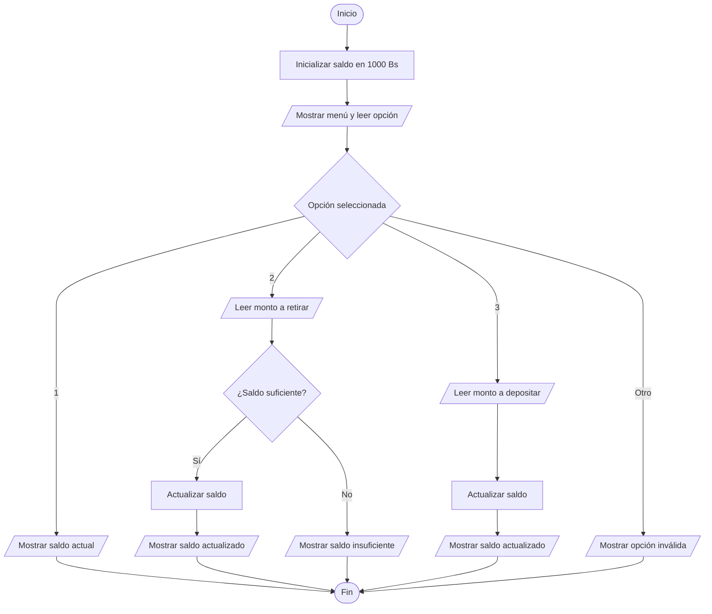

# Ejercicio 09 - Simulación de un Cajero Automático

## Enunciado

Simular un cajero automático con un saldo inicial de 1000 Bs.

Permitir al usuario elegir una opción:

1. Ver saldo.
2. Retirar dinero (validar saldo suficiente).
3. Depositar dinero.

Mostrar el saldo actualizado después de cada operación.

---

# Análisis del Problema

## Entradas

| Dato   | Tipo  |
| ------ | ----- |
| opcion | int   |
| monto  | float |

---

## Proceso

1. Inicializar el saldo en 1000 Bs.
2. Mostrar un menú de opciones.
3. Leer la opción seleccionada.
4. Ejecutar la operación correspondiente.
5. Actualizar el saldo cuando sea necesario.
6. Mostrar el resultado de la operación.

---

## Salidas

| Salida                |
| --------------------- |
| Saldo actual          |
| Saldo actualizado     |
| Mensajes de operación |

---

# Diseño de la Solución

## Secuencia Lógica

1. Inicio.
2. Inicializar saldo en 1000 Bs.
3. Mostrar menú de opciones.
4. Leer opción.
5. Evaluar la opción seleccionada.
6. Si selecciona ver saldo, mostrar saldo actual.
7. Si selecciona retirar dinero:

   * Leer monto.
   * Verificar saldo suficiente.
   * Actualizar saldo.
8. Si selecciona depositar dinero:

   * Leer monto.
   * Actualizar saldo.
9. Si la opción no existe, mostrar mensaje de error.
10. Fin.

---

## Variables Utilizadas

| Variable | Tipo  | Descripción                        |
| -------- | ----- | ---------------------------------- |
| saldo    | float | Saldo disponible en la cuenta      |
| monto    | float | Cantidad a retirar o depositar     |
| opcion   | int   | Opción seleccionada por el usuario |

---

## Operadores Utilizados

| Operador | Tipo       | Uso                        |
| -------- | ---------- | -------------------------- |
| +        | Aritmético | Depositar dinero           |
| -        | Aritmético | Retirar dinero             |
| <=       | Relacional | Verificar saldo suficiente |
| =        | Asignación | Actualizar saldo           |

---

## Estructuras Utilizadas

### Selección Múltiple

```text
switch
```

Permite ejecutar una opción específica del menú.

### Condicional

```text
if
```

Permite validar que exista saldo suficiente para realizar un retiro.

---

## Fórmulas Utilizadas

### Retiro

```text
saldo = saldo - monto
```

### Depósito

```text
saldo = saldo + monto
```

---

# Pseudocódigo

```text
INICIO

    Definir saldo Como float
    Definir monto Como float
    Definir opcion Como int

    saldo ← 1000

    Mostrar "===== CAJERO ====="
    Mostrar "1. Ver saldo"
    Mostrar "2. Retirar dinero"
    Mostrar "3. Depositar dinero"

    Leer opcion

    Segun opcion Hacer

        Caso 1:

            Mostrar "Saldo actual: "
            Mostrar saldo

        Caso 2:

            Mostrar "Monto a retirar:"
            Leer monto

            Si monto <= saldo Entonces

                saldo ← saldo - monto

                Mostrar "Retiro realizado"

                Mostrar "Saldo actual: "
                Mostrar saldo

            Sino

                Mostrar "Saldo insuficiente"

            FinSi

        Caso 3:

            Mostrar "Monto a depositar:"
            Leer monto

            saldo ← saldo + monto

            Mostrar "Deposito realizado"

            Mostrar "Saldo actual: "
            Mostrar saldo

        De Otro Modo:

            Mostrar "Opcion invalida"

    FinSegun

FIN
```

---

# Diagrama de Flujo



---

# Prueba de Escritorio

## Caso 1 - Ver Saldo

| Saldo Inicial | Opción | Resultado              |
| ------------- | ------ | ---------------------- |
| 1000          | 1      | Saldo actual = 1000 Bs |

---

## Caso 2 - Retiro Correcto

| Saldo Inicial | Opción | Monto | Saldo Final |
| ------------- | ------ | ----- | ----------- |
| 1000          | 2      | 300   | 700         |

---

## Caso 3 - Retiro con Saldo Insuficiente

| Saldo Inicial | Opción | Monto | Resultado          |
| ------------- | ------ | ----- | ------------------ |
| 1000          | 2      | 1500  | Saldo insuficiente |

---

## Caso 4 - Depósito

| Saldo Inicial | Opción | Monto | Saldo Final |
| ------------- | ------ | ----- | ----------- |
| 1000          | 3      | 500   | 1500        |

---

# Implementación en C++

```cpp
#include <iostream>

using namespace std;

int main() {

    float saldo = 1000;
    float monto;

    int opcion;

    cout << "===== CAJERO =====\n";

    cout << "1. Ver saldo\n";
    cout << "2. Retirar dinero\n";
    cout << "3. Depositar dinero\n";

    cout << "\nSeleccione una opcion: ";
    cin >> opcion;

    switch (opcion) {

        case 1:

            cout << "Saldo actual: " << saldo << " Bs\n";

            break;

        case 2:

            cout << "Monto a retirar: ";
            cin >> monto;

            if (monto <= saldo) {

                saldo -= monto;

                cout << "Retiro realizado\n";

                cout << "Saldo actual: " << saldo << " Bs\n";

            } else {

                cout << "Saldo insuficiente\n";

            }

            break;

        case 3:

            cout << "Monto a depositar: ";
            cin >> monto;

            saldo += monto;

            cout << "Deposito realizado\n";

            cout << "Saldo actual: " << saldo << " Bs\n";

            break;

        default:

            cout << "Opcion invalida\n";

    }

    return 0;
}
```

---

# Ejemplo de Ejecución

```text
===== CAJERO =====

1. Ver saldo
2. Retirar dinero
3. Depositar dinero

Seleccione una opcion: 2

Monto a retirar: 300

Retiro realizado

Saldo actual: 700 Bs
```

---

# Observaciones

* Es el primer ejercicio que utiliza una estructura `switch`.
* Introduce el concepto de menú de opciones.
* Utiliza una validación para evitar retiros mayores al saldo disponible.
* Simula operaciones básicas de un cajero automático.
* El saldo cambia durante la ejecución del programa.

---

# Temas Relacionados

* Variables y Tipos de Datos
* Operadores Aritméticos
* Operadores Relacionales
* Condicionales
* Switch
* Menús
* Validación de Datos
* Diagramas de Flujo
* Pruebas de Escritorio
