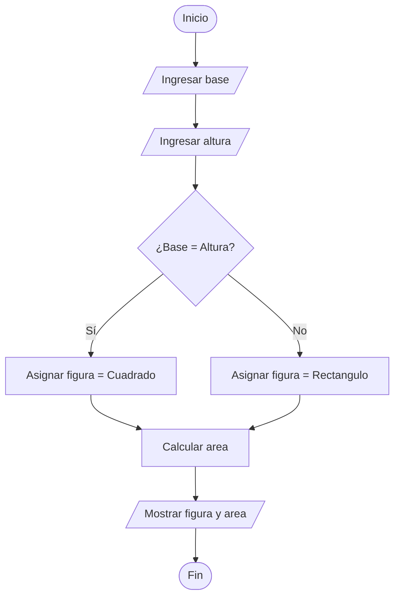

# Ejercicio 10 - Área y Tipo de Figura Geométrica

## Enunciado

Solicitar los datos necesarios y calcular el área correspondiente de una figura geométrica (rectángulo o cuadrado).

Determinar el tipo de figura y mostrar el área calculada.

---

# Análisis del Problema

## Entradas

| Dato   | Tipo  |
| ------ | ----- |
| base   | float |
| altura | float |

---

## Proceso

1. Leer la base de la figura.
2. Leer la altura de la figura.
3. Determinar si la figura es un cuadrado o un rectángulo.
4. Calcular el área de la figura.
5. Mostrar el tipo de figura.
6. Mostrar el área calculada.

---

## Salidas

| Salida         |
| -------------- |
| Tipo de figura |
| Área calculada |

---

# Diseño de la Solución

## Secuencia Lógica

1. Inicio.
2. Solicitar la base.
3. Leer la base.
4. Solicitar la altura.
5. Leer la altura.
6. Comparar base y altura.
7. Si son iguales, la figura es un cuadrado.
8. Si son diferentes, la figura es un rectángulo.
9. Calcular el área.
10. Mostrar el tipo de figura.
11. Mostrar el área calculada.
12. Fin.

---

## Variables Utilizadas

| Variable | Tipo   | Descripción         |
| -------- | ------ | ------------------- |
| base     | float  | Base de la figura   |
| altura   | float  | Altura de la figura |
| area     | float  | Área calculada      |
| figura   | string | Tipo de figura      |

---

## Operadores Utilizados

| Operador | Tipo       | Uso                    |
| -------- | ---------- | ---------------------- |
| *        | Aritmético | Calcular el área       |
| ==       | Relacional | Comparar base y altura |
| =        | Asignación | Guardar valores        |

---

## Estructuras Utilizadas

### Condicional

```text
if - else
```

Permite determinar el tipo de figura.

---

## Fórmula Utilizada

### Área

```text
area = base * altura
```

---

# Pseudocódigo

```text
INICIO

    Definir base Como float
    Definir altura Como float
    Definir area Como float

    Definir figura Como string

    Escribir "Ingrese la base:"
    Leer base

    Escribir "Ingrese la altura:"
    Leer altura

    Si base == altura Entonces

        figura ← "Cuadrado"

    Sino

        figura ← "Rectangulo"

    FinSi

    area ← base * altura

    Mostrar "Tipo de figura: "
    Mostrar figura

    Mostrar "Area: "
    Mostrar area

FIN
```

---

# Diagrama de Flujo



---

# Prueba de Escritorio

| Base | Altura | Figura     | Área |
| ---- | ------ | ---------- | ---- |
| 5    | 5      | Cuadrado   | 25   |
| 4    | 6      | Rectángulo | 24   |
| 8    | 8      | Cuadrado   | 64   |
| 3    | 10     | Rectángulo | 30   |

---

# Implementación en C++

```cpp
#include <iostream>
#include <string>

using namespace std;

int main() {

    float base;
    float altura;
    float area;

    string figura;

    cout << "Ingrese la base: ";
    cin >> base;

    cout << "Ingrese la altura: ";
    cin >> altura;

    if (base == altura) {

        figura = "Cuadrado";

    } else {

        figura = "Rectangulo";

    }

    area = base * altura;

    cout << "\nTipo de figura: " << figura << endl;

    cout << "Area: " << area << endl;

    return 0;
}
```

---

# Ejemplo de Ejecución

```text
Ingrese la base: 5
Ingrese la altura: 5

Tipo de figura: Cuadrado
Area: 25
```

---

# Observaciones

* El área de un cuadrado y un rectángulo se calcula con la misma fórmula.
* El tipo de figura se determina comparando la base y la altura.
* Si base y altura son iguales, la figura es un cuadrado.
* Si base y altura son diferentes, la figura es un rectángulo.
* El área por sí sola no permite identificar el tipo de figura.

---

# Temas Relacionados

* Variables y Tipos de Datos
* Operadores Aritméticos
* Operadores Relacionales
* Condicionales (if - else)
* Diagramas de Flujo
* Pruebas de Escritorio
* Figuras Geométricas
