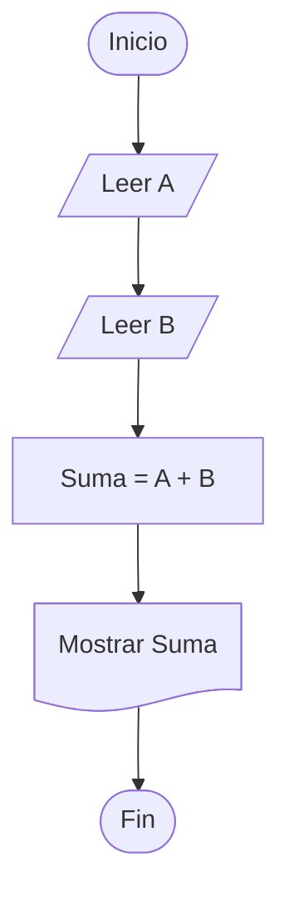
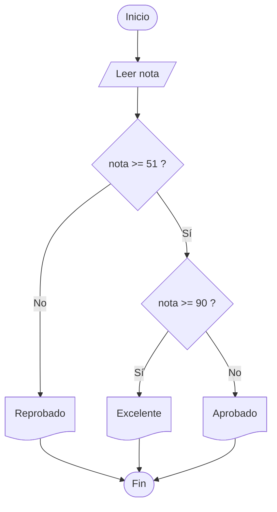
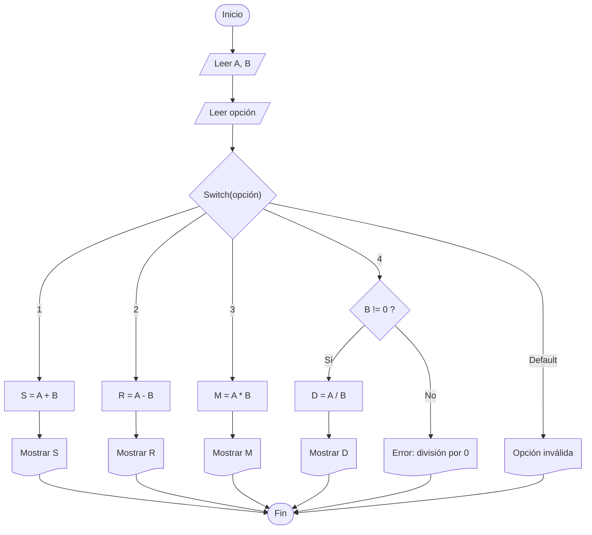
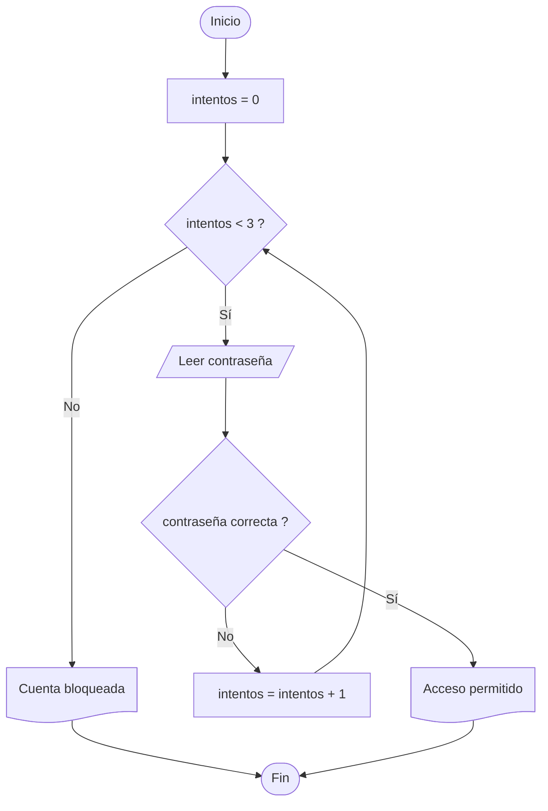
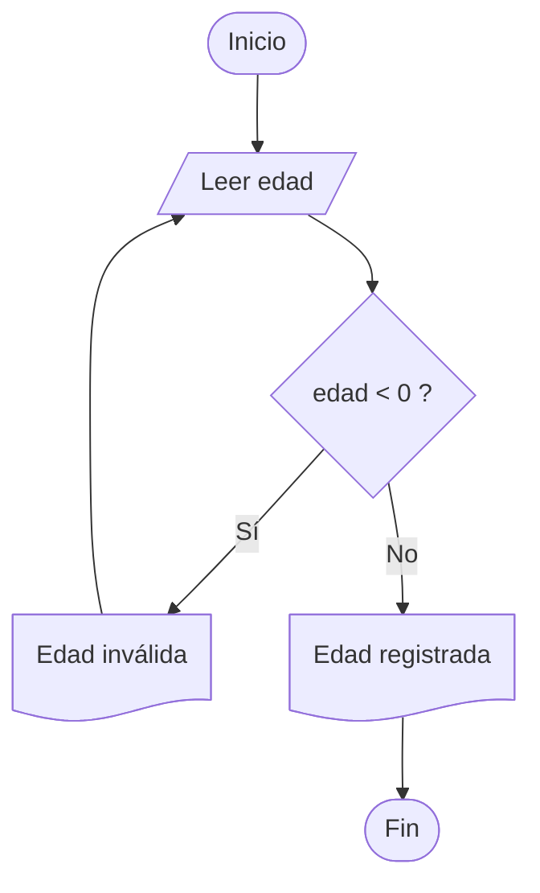
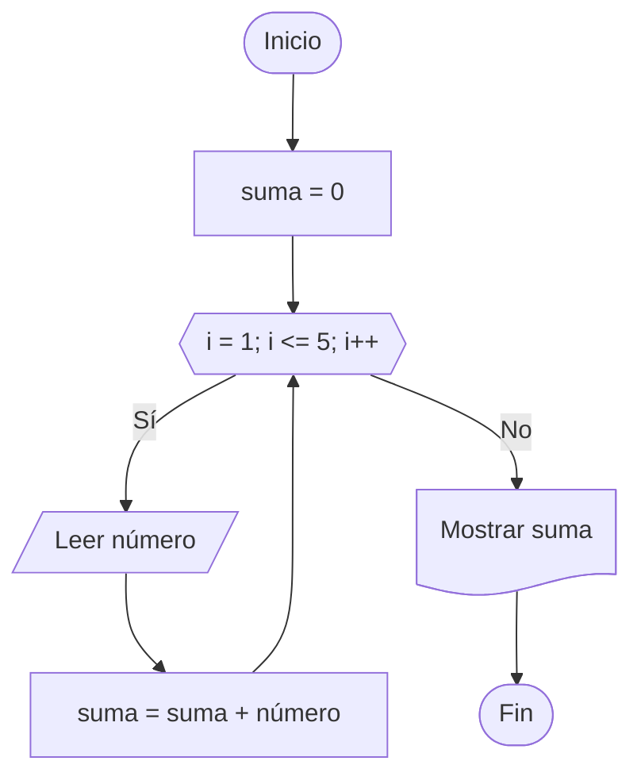

# Diagramas de Flujo

---

## ¿Qué es un diagrama de flujo?

Un **diagrama de flujo** es la representación gráfica de un algoritmo o proceso mediante símbolos conectados por flechas.

Permite visualizar de forma clara y ordenada los pasos necesarios para resolver un problema.

Se utiliza en:

- Programación
- Sistemas
- Procesos administrativos
- Matemática
- Ingeniería
- Diseño de soluciones

---

## Importancia

Los diagramas de flujo ayudan a:

- Comprender mejor un problema
- Organizar pasos lógicos
- Detectar errores antes de programar
- Comunicar procesos fácilmente
- Facilitar mantenimiento de sistemas

---

# Elementos básicos

Todo diagrama de flujo está compuesto por:

- Símbolos
- Flechas
- Texto descriptivo
- Secuencia lógica

---

# Símbolos principales

## 1. Inicio / Fin

~~~mermaid
flowchart TD
A@{ shape: stadium, label: "Inicio" }
B@{ shape: stadium, label: "Fin"}
A-->B
~~~

---

## 2. Proceso

~~~mermaid
flowchart TD
A@{ shape: rect, label: "Calcular suma" }
~~~

---

## 3. Entrada / Salida

~~~mermaid
flowchart TD
A@{ shape: lean-r, label: "Leer número" }
B@{ shape: doc, label: "Mostrar resultado" }
A-->B
~~~

---

## 4. Decisión

~~~mermaid
flowchart TD
A@{ shape: diamond, label: "Condición" }
~~~

---

## 5. Lineas de flujo de informacion

~~~mermaid
flowchart LR
A(( )) --> B(( ))
~~~

---

## 6. Seleccion multiple "Switch"

~~~mermaid
flowchart TD
A@{ shape: diamond, label: "switch(opción)" }

A -->|1| B@{ shape: rect, label: "Case 1" }
A -->|2| C@{ shape: rect, label: "Case 2" }
A -->|3| D@{ shape: rect, label: "Case 3" }
A -->|default| E@{ shape: rect, label: "Otro" }
~~~

## 7. Repetitiva While

~~~mermaid
flowchart TD
A@{ shape: diamond, label: "while i < 10" }

A -->|No| B@{ shape: rect, label: "Salir" }
B --> A
A -->|Si| C@{ shape: rect, label: "Proceso" }
~~~

## 8. Repetitiva Do While

~~~mermaid
flowchart TD
A@{ shape: rect, label: "Proceso" }
B@{ shape: diamond, label: "Do While" }

A --> B
~~~

## 9. Repetitiva For

~~~mermaid
flowchart TD
A@{ shape: hex, label: "i=0; i-1; i++" }
~~~

---

# Reglas para elaborar diagramas

- Debe tener Inicio y Fin
- Leer de arriba hacia abajo
- Usar flechas claras
- Evitar cruces innecesarios
- Cada símbolo cumple una función
- Texto corto y entendible

---

# Tipos de estructuras en diagramas

Por ahora trabajaremos solo con diagramas de flujo, enfocados en las 3 estructuras principales:

1. Secuencial
2. Selectivas
3. Repetitivas

---

## 1. Estructura Secuencial

Se ejecutan instrucciones una tras otra, en orden.

### Ejemplo:

Leer dos números, sumarlos y mostrar resultado.

---

## 2. Estructuras Selectivas

Permiten tomar decisiones.

Incluyen:

* If simple
* If else
* Switch

---

### Ejemplo IF

**Problema:** Leer una nota y clasificarla:

* Si la nota es mayor o igual a 51 → Aprobado
* Si además es mayor o igual a 90 → Excelente
* Si no llega a 51 → Reprobado

---

### Ejemplo SWITCH

**Problema:** Leer dos números `A` y `B`, luego elegir una operación matemática mediante una opción.

* 1 → Sumar
* 2 → Restar
* 3 → Multiplicar
* 4 → Dividir
* Otro valor → Error

---

## 3. Estructuras Repetitivas

Repiten instrucciones.

Incluyen:

* While
* Do While
* For

---

### Ejemplo WHILE

**Problema:** Un cajero automático permite hasta 3 intentos para ingresar la contraseña correcta.
Si la contraseña es correcta, muestra **Acceso permitido**.
Si falla 3 veces, muestra **Cuenta bloqueada**.

---

### Ejemplo DO WHILE

**Problema:** Solicitar una edad válida.
La edad debe ser mayor o igual a `0`.
Primero se pide el dato y luego se verifica, por eso se usa **do while**.

---

### Ejemplo FOR

**Problema:** Leer `5` números, sumarlos y mostrar la suma total.
Se utiliza **for** porque se conoce desde el inicio la cantidad de repeticiones.

---

# Ventajas

- Fácil comprensión visual
- Orden lógico claro
- Detecta errores temprano
- Sirve para documentación
- Útil para aprender programación

---

# Desventajas

- Diagramas grandes pueden complicarse
- Cambios constantes requieren edición
- No reemplaza código real

---

# Errores comunes

- No colocar Inicio / Fin
- Flechas mal orientadas
- Decisiones sin dos salidas
- Exceso de texto
- Saltar pasos importantes

---

# Aplicaciones reales

- Sistemas informáticos
- Bancos
- Procesos industriales
- Apps móviles
- Juegos
- Algoritmos matemáticos

---

# Diferencia con pseudocódigo

| Diagrama de flujo | Pseudocódigo           |
|-------------------|------------------------|
| Visual            | Texto                  |
| Usa símbolos      | Usa instrucciones      |
| Más gráfico       | Más parecido al código |

---

# Recomendaciones

- Diseñar primero en papel
- Mantener simpleza
- Nombrar bien procesos
- Probar lógica paso a paso

---

# Resumen

- Representa algoritmos gráficamente
- Usa símbolos estándar
- Muestra secuencia, decisiones y ciclos
- Ayuda antes de programar
- Fundamental en lógica computacional

---
