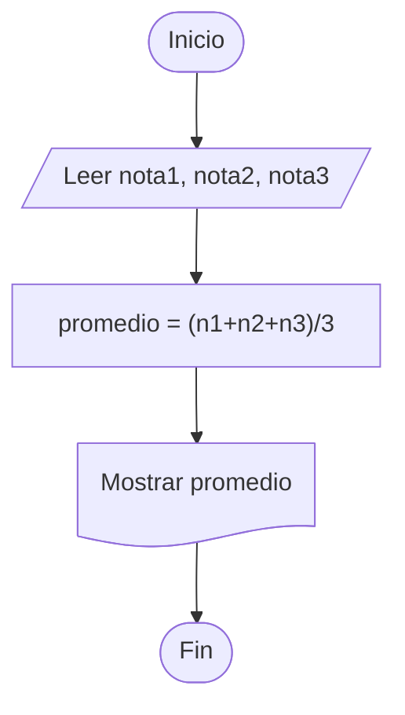

# Resolución de Problemas en Programación

La programación no consiste solamente en escribir código.
Antes de utilizar un lenguaje como Python, Java o C++, es necesario analizar el problema, diseñar una solución lógica y comprobar que funcione correctamente.

La **resolución de problemas** permite construir programas claros, ordenados y con menos errores.

---

# Objetivos del Tema

Al estudiar este tema se busca:

* Comprender correctamente un problema.
* Identificar datos necesarios.
* Diseñar algoritmos lógicos.
* Representar soluciones mediante diagramas.
* Verificar resultados antes de programar.

---

# Etapas de la Resolución de Problemas

1. Análisis del Problema
2. Algoritmo o Pseudocódigo
3. Diagrama de Flujo
4. Prueba de Escritorio

---

# 1. Análisis del Problema

Es la primera etapa y una de las más importantes.
Consiste en entender qué pide el ejercicio y cómo se resolverá.

## Elementos del análisis

### Objetivo

Describe lo que se desea lograr.

```text id="k2s4e7"
Calcular el promedio de tres notas.
```

### Datos de Entrada

Son los valores necesarios para resolver el problema.

```text id="l6q9t2"
nota1, nota2, nota3
```

### Proceso

Son operaciones o fórmulas necesarias.

```text id="hlcuz2"
promedio = (nota1 + nota2 + nota3) / 3
```

### Datos de Salida

Es el resultado obtenido.

```text id="u6vqzi"
promedio
```

---

# 2. Algoritmo o Pseudocódigo

Es la descripción paso a paso de la solución usando lenguaje sencillo.

## Ejemplo

```text id="a6wvf5"
Inicio
   Leer nota1, nota2, nota3
   promedio = (nota1 + nota2 + nota3) / 3
   Mostrar promedio
Fin
```

## Ventajas

* Fácil de entender.
* No depende de un lenguaje real.
* Ayuda a organizar ideas.

---

# 3. Diagrama de Flujo

Representa visualmente el algoritmo mediante símbolos.

## Ejemplo



## Ventajas

* Facilita la comprensión visual.
* Ordena procesos complejos.
* Ayuda a detectar errores.

---

# 4. Prueba de Escritorio

Consiste en probar manualmente el algoritmo con datos reales o simulados.

## Ejemplo

| nota1 | nota2 | nota3 | promedio |
| ----- | ----- | ----- | -------- |
| 60    | 70    | 80    | 70       |

## Importancia

Permite verificar:

* Operaciones correctas.
* Resultados esperados.
* Posibles errores lógicos.

---

# Errores Comunes

* No leer bien el problema.
* Omitir datos de entrada.
* Usar fórmulas incorrectas.
* No realizar prueba de escritorio.
* Crear diagramas desordenados.

---

# Recomendaciones

1. Leer el problema varias veces.
2. Identificar entrada, proceso y salida.
3. Escribir pseudocódigo antes de programar.
4. Hacer prueba de escritorio.
5. Recién después codificar.

---

# Conclusión

Resolver problemas correctamente es la base de toda programación.
Un buen análisis y una solución ordenada permiten crear programas más claros, eficientes y profesionales.
