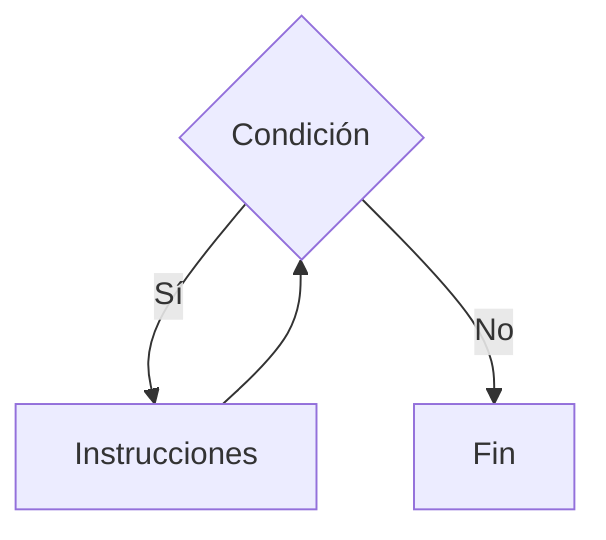
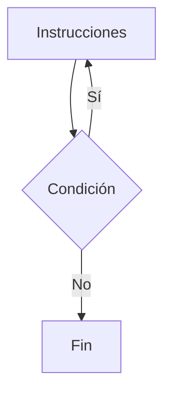
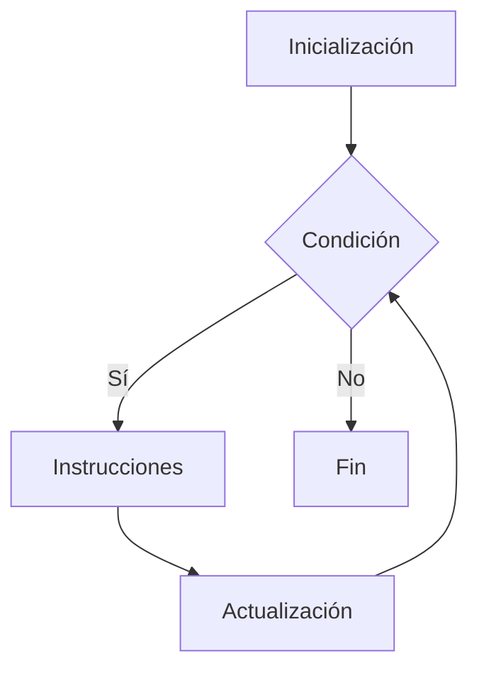

# Estructuras Repetitivas

## ¿Qué son las estructuras repetitivas?

Las **estructuras repetitivas** son instrucciones de control que permiten ejecutar un conjunto de acciones varias veces mientras se cumpla una condición o durante una cantidad determinada de repeticiones.

También son conocidas como:

* Ciclos
* Bucles (*loops*)
* Iteraciones

---

# Importancia

Las estructuras repetitivas permiten:

* Automatizar tareas repetitivas.
* Reducir la cantidad de código.
* Procesar grandes cantidades de datos.
* Resolver problemas de manera eficiente.

Sin ellas sería necesario escribir la misma instrucción múltiples veces.

---

# Concepto de repetición

Una repetición consiste en ejecutar una o más instrucciones varias veces.

### Ejemplo conceptual

```text
Mostrar "Hola"
Mostrar "Hola"
Mostrar "Hola"
Mostrar "Hola"
Mostrar "Hola"
```

Utilizando una estructura repetitiva:

```text
Repetir 5 veces

    Mostrar "Hola"

Fin Repetir
```

El resultado es el mismo, pero con una solución más eficiente.

---

# Elementos de una estructura repetitiva

| Elemento         | Descripción                                      |
| ---------------- | ------------------------------------------------ |
| Inicialización   | Valor inicial utilizado para comenzar el ciclo.  |
| Condición        | Determina si el ciclo continúa o finaliza.       |
| Actualización    | Modifica los valores utilizados en la condición. |
| Cuerpo del ciclo | Conjunto de instrucciones que se repiten.        |

---

# Flujo de ejecución

Una estructura repetitiva sigue generalmente el siguiente proceso:

```text
Inicialización
      ↓
Evaluar condición
      ↓
Ejecutar instrucciones
      ↓
Actualizar datos
      ↓
Volver a evaluar condición
```

---

# Clasificación

Las estructuras repetitivas más utilizadas son:

| Estructura | Característica principal                     |
| ---------- | -------------------------------------------- |
| While      | Evalúa la condición antes de ejecutar.       |
| Do While   | Ejecuta al menos una vez.                    |
| For        | Controla la repetición mediante un contador. |

---

# 1. While

La condición se evalúa antes de ejecutar el ciclo.

### Representación



### Característica

Puede ejecutarse cero o más veces.

---

# 2. Do While

La condición se evalúa después de ejecutar el ciclo.

### Representación



### Característica

Se ejecuta al menos una vez.

---

# 3. For

Utiliza una variable de control para administrar las repeticiones.

### Representación



### Característica

Ideal cuando se conoce la cantidad de repeticiones.

---

# Comparación

| Característica            | While   | Do While | For         |
| ------------------------- | ------- | -------- | ----------- |
| Evalúa antes              | Sí      | No       | Sí          |
| Ejecuta al menos una vez  | No      | Sí       | No          |
| Usa contador integrado    | No      | No       | Sí          |
| Repeticiones conocidas    | Posible | Posible  | Ideal       |
| Repeticiones desconocidas | Ideal   | Ideal    | Menos común |

---

# Aplicaciones

Las estructuras repetitivas se utilizan en:

* Recorrido de tablas.
* Menús interactivos.
* Validación de datos.
* Procesamiento de información.
* Cálculos repetitivos.
* Videojuegos.
* Simulaciones.

---

# Ventajas

| Ventaja        | Descripción                                               |
| -------------- | --------------------------------------------------------- |
| Automatización | Evita repetir código.                                     |
| Eficiencia     | Reduce instrucciones innecesarias.                        |
| Flexibilidad   | Permite resolver problemas complejos.                     |
| Escalabilidad  | Facilita el procesamiento de grandes cantidades de datos. |

---

# Riesgos

| Riesgo                   | Descripción                         |
| ------------------------ | ----------------------------------- |
| Ciclos infinitos         | La condición nunca se vuelve falsa. |
| Actualización incorrecta | El ciclo no termina correctamente.  |
| Condiciones erróneas     | Produce resultados inesperados.     |

---

# Errores comunes

| Error                                 | Descripción                          |
| ------------------------------------- | ------------------------------------ |
| Olvidar actualizar variables          | Produce ciclos infinitos.            |
| Condiciones incorrectas               | Generan comportamientos inesperados. |
| Utilizar el ciclo incorrecto          | Complica la solución.                |
| No considerar el caso de finalización | El programa puede quedar bloqueado.  |

---

# Información complementaria

Para comprender los operadores utilizados en las condiciones consulte:

* [Operadores básicos](../Tema02_Datos/03-operadores_basicos.md)

Para comprender la teoría general de las instrucciones de control consulte:

* [Instrucciones de control](01-introduccion.md)

Para comprender las estructuras condicionales consulte:

* [Condicionales](03-condicionales.md)

---

# Conclusión

Las estructuras repetitivas permiten ejecutar instrucciones múltiples veces de forma controlada y eficiente. Constituyen una herramienta fundamental para automatizar tareas y procesar grandes cantidades de información dentro de los programas.

---

# Resumen

| Concepto         | Idea principal                       |
| ---------------- | ------------------------------------ |
| Repetición       | Ejecución múltiple de instrucciones. |
| While            | Evalúa antes de ejecutar.            |
| Do While         | Ejecuta al menos una vez.            |
| For              | Utiliza un contador integrado.       |
| Riesgo principal | Ciclos infinitos.                    |
| Importancia      | Automatización y eficiencia.         |
