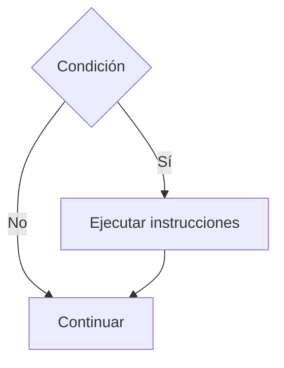

# If Simple

## ¿Qué es el If Simple?

El **If Simple** es una estructura condicional que permite ejecutar un conjunto de instrucciones únicamente cuando una condición es verdadera.

Si la condición es falsa, las instrucciones contenidas dentro del bloque no se ejecutan.

---

# Importancia

El If Simple permite:

* Tomar decisiones básicas.
* Validar datos.
* Ejecutar acciones bajo ciertas condiciones.
* Controlar el flujo de un programa.

Es la estructura condicional más sencilla y la base para comprender estructuras más complejas.

---

# Funcionamiento

El proceso sigue la siguiente lógica:

1. Evaluar una condición.
2. Si la condición es verdadera, ejecutar las instrucciones.
3. Si la condición es falsa, continuar con el flujo normal del programa.

---

# Estructura general

## Pseudocódigo

```text
Si condición Entonces

    Instrucciones

Fin Si
```

---

# Diagrama de flujo



---

# Ejemplo conceptual

## Problema

Determinar si una persona es mayor de edad.

### Pseudocódigo

```text
Inicio

    Leer edad

    Si edad >= 18 Entonces

        Mostrar "Mayor de edad"

    Fin Si

Fin
```

---

# Prueba de escritorio

### Caso 1

```text
edad = 20
```

| Paso            | edad          |
| --------------- | ------------- |
| Leer edad       | 20            |
| edad >= 18      | Verdadero     |
| Mostrar mensaje | Mayor de edad |

### Resultado

```text
Mayor de edad
```

---

### Caso 2

```text
edad = 15
```

| Paso            | edad          |
| --------------- | ------------- |
| Leer edad       | 15            |
| edad >= 18      | Falso         |
| Mostrar mensaje | No se ejecuta |

### Resultado

```text
Sin salida
```

---

# Implementación en C++

## Sintaxis

```cpp
if (condicion) {
    instrucciones;
}
```

---

## Ejemplo

```cpp
#include <iostream>

using namespace std;

int main() {

    int edad;

    cout << "Ingrese su edad: ";
    cin >> edad;

    if (edad >= 18) {
        cout << "Mayor de edad" << endl;
    }

    return 0;
}
```

---

# Ejecución

### Entrada

```text
20
```

### Salida

```text
Mayor de edad
```

---

### Entrada

```text
15
```

### Salida

```text
(no muestra nada)
```

---

# Aplicaciones

El If Simple se utiliza para:

* Verificar edades.
* Validar contraseñas.
* Comprobar límites.
* Detectar errores.
* Controlar permisos.

---

# Ventajas

| Ventaja      | Descripción                             |
| ------------ | --------------------------------------- |
| Simplicidad  | Fácil de comprender e implementar.      |
| Claridad     | Permite expresar decisiones simples.    |
| Flexibilidad | Puede combinarse con otras estructuras. |

---

# Limitaciones

| Limitación                                                       | Descripción |
| ---------------------------------------------------------------- | ----------- |
| Solo ejecuta acciones cuando la condición es verdadera.          |             |
| No permite definir una alternativa cuando la condición es falsa. |             |

Para esos casos se utiliza:

```text
If - Else
```

---

# Errores comunes

| Error                      | Descripción                          |
| -------------------------- | ------------------------------------ |
| Utilizar = en lugar de ==  | Confunde asignación con comparación. |
| Omitir llaves              | Puede producir errores de lectura.   |
| Condiciones incorrectas    | Generan resultados inesperados.      |
| No probar ambos escenarios | Puede ocultar errores lógicos.       |

---

# Información complementaria

Para comprender los operadores utilizados en las condiciones consulte:

* [Operadores básicos](../../Tema02_Datos/03-operadores_basicos.md)

Para conocer la teoría general de las estructuras condicionales consulte:

* [Condicionales](../03-condicionales.md)

---

# Conclusión

El If Simple es la estructura condicional más básica y permite ejecutar instrucciones únicamente cuando una condición es verdadera. Constituye el punto de partida para la toma de decisiones dentro de los programas.

---

# Resumen

| Concepto      | Idea principal                                      |
| ------------- | --------------------------------------------------- |
| If Simple     | Ejecuta acciones cuando una condición es verdadera. |
| Condición     | Expresión que puede ser verdadera o falsa.          |
| Uso principal | Toma de decisiones básicas.                         |
| Ventaja       | Simplicidad y claridad.                             |
| Base para     | If Else, If Anidado y otras estructuras.            |
