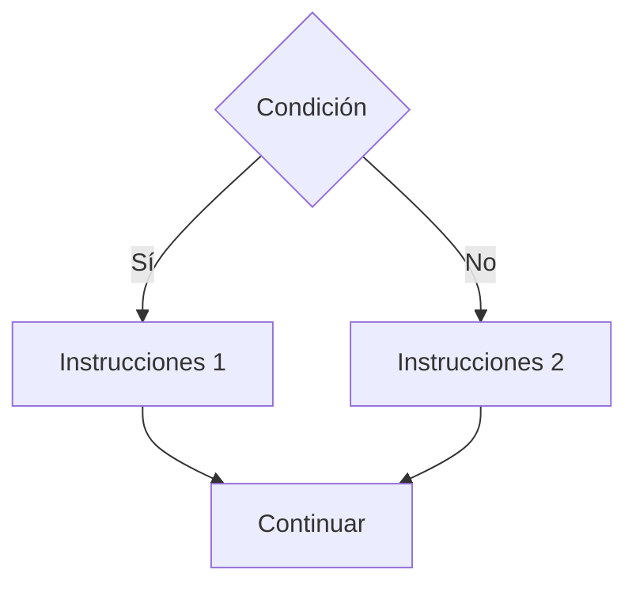

# If Else

## ¿Qué es el If Else?

El **If Else** es una estructura condicional que permite elegir entre dos caminos de ejecución dependiendo del resultado de una condición.

* Si la condición es verdadera, se ejecuta un bloque de instrucciones.
* Si la condición es falsa, se ejecuta un bloque alternativo.

---

# Importancia

El If Else permite:

* Tomar decisiones con dos posibles resultados.
* Controlar el flujo de ejecución.
* Resolver problemas con alternativas.
* Mejorar la lógica de los programas.

---

# Funcionamiento

El proceso sigue la siguiente lógica:

1. Evaluar una condición.
2. Si la condición es verdadera, ejecutar el bloque `if`.
3. Si la condición es falsa, ejecutar el bloque `else`.
4. Continuar con el programa.

---

# Estructura general

## Pseudocódigo

```text
Si condición Entonces

    Instrucciones 1

Sino

    Instrucciones 2

Fin Si
```

---

# Diagrama de flujo



---

# Ejemplo conceptual

## Problema

Determinar si un estudiante aprobó o reprobó.

### Pseudocódigo

```text
Inicio

    Leer nota

    Si nota >= 51 Entonces

        Mostrar "Aprobado"

    Sino

        Mostrar "Reprobado"

    Fin Si

Fin
```

---

# Prueba de escritorio

## Caso 1

```text
nota = 75
```

| Paso            | nota      |
| --------------- | --------- |
| Leer nota       | 75        |
| nota >= 51      | Verdadero |
| Mostrar mensaje | Aprobado  |

### Resultado

```text
Aprobado
```

---

## Caso 2

```text
nota = 40
```

| Paso            | nota      |
| --------------- | --------- |
| Leer nota       | 40        |
| nota >= 51      | Falso     |
| Mostrar mensaje | Reprobado |

### Resultado

```text
Reprobado
```

---

# Implementación en C++

## Sintaxis

```cpp
if (condicion) {

    instrucciones_1;

} else {

    instrucciones_2;

}
```

---

# Ejemplo

```cpp
#include <iostream>

using namespace std;

int main() {

    int nota;

    cout << "Ingrese la nota: ";
    cin >> nota;

    if (nota >= 51) {

        cout << "Aprobado" << endl;

    } else {

        cout << "Reprobado" << endl;

    }

    return 0;
}
```

---

# Ejecución

## Entrada

```text
75
```

### Salida

```text
Aprobado
```

---

## Entrada

```text
40
```

### Salida

```text
Reprobado
```

---

# Comparación con If Simple

| Característica             | If Simple | If Else |
| -------------------------- | --------- | ------- |
| Evalúa condición           | Sí        | Sí      |
| Acción cuando es verdadera | Sí        | Sí      |
| Acción cuando es falsa     | No        | Sí      |
| Complejidad                | Menor     | Mayor   |

---

# Aplicaciones

El If Else se utiliza para:

* Validar usuarios.
* Verificar aprobaciones.
* Determinar descuentos.
* Controlar acceso a sistemas.
* Clasificar resultados.

---

# Ventajas

| Ventaja      | Descripción                               |
| ------------ | ----------------------------------------- |
| Flexibilidad | Permite dos caminos de ejecución.         |
| Claridad     | Hace explícitas ambas posibilidades.      |
| Organización | Mejora la estructura lógica del programa. |

---

# Limitaciones

| Limitación                                                      | Descripción |
| --------------------------------------------------------------- | ----------- |
| Solo permite dos alternativas directas.                         |             |
| Muchas condiciones pueden volver el código difícil de mantener. |             |

Para múltiples alternativas se utilizan:

```text
If Anidado
Switch
```

---

# Errores comunes

| Error                     | Descripción                    |
| ------------------------- | ------------------------------ |
| Utilizar = en lugar de == | Produce errores lógicos.       |
| Invertir la condición     | Genera resultados incorrectos. |
| No probar ambos casos     | Puede ocultar errores.         |
| Anidar excesivamente      | Reduce la legibilidad.         |

---

# Información complementaria

Para comprender los operadores utilizados en las condiciones consulte:

* [Operadores básicos](../../Tema02_Datos/03-operadores_basicos.md)

Para conocer el If Simple consulte:

* [If Simple](01-if_simple.md)

Para comprender la teoría general de las estructuras condicionales consulte:

* [Condicionales](../03-condicionales.md)

---

# Conclusión

El If Else permite seleccionar entre dos caminos de ejecución dependiendo del resultado de una condición. Es una de las estructuras más utilizadas en programación y constituye la base para la construcción de decisiones más complejas.

---

# Resumen

| Concepto   | Idea principal                                  |
| ---------- | ----------------------------------------------- |
| If Else    | Permite elegir entre dos alternativas.          |
| Condición  | Determina qué bloque se ejecuta.                |
| If         | Se ejecuta cuando la condición es verdadera.    |
| Else       | Se ejecuta cuando la condición es falsa.        |
| Aplicación | Toma de decisiones con dos posibles resultados. |
