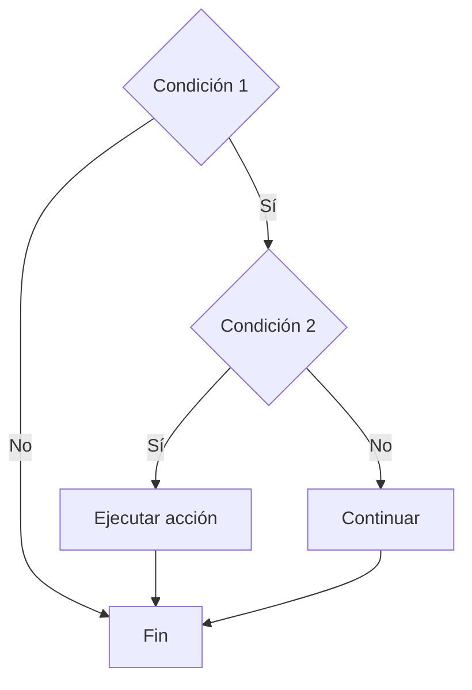
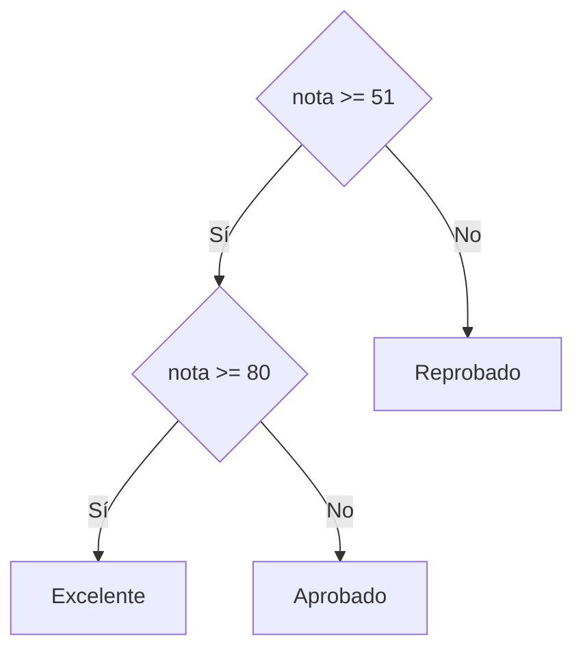

# If Anidado

## ¿Qué es el If Anidado?

Un **If Anidado** es una estructura condicional que contiene una o más instrucciones `if` dentro de otro `if`.

Permite evaluar múltiples condiciones de manera jerárquica para resolver problemas que requieren varios niveles de decisión.

---

# Importancia

El If Anidado permite:

* Evaluar múltiples condiciones.
* Tomar decisiones complejas.
* Clasificar información.
* Resolver problemas con varios escenarios posibles.

---

# Funcionamiento

El proceso sigue la siguiente lógica:

1. Evaluar una primera condición.
2. Si se cumple, evaluar una segunda condición.
3. Continuar evaluando condiciones según sea necesario.
4. Ejecutar la acción correspondiente.

---

# Estructura general

## Pseudocódigo

```text
Si condición_1 Entonces

    Si condición_2 Entonces

        Instrucciones

    Fin Si

Fin Si
```

---

# Diagrama de flujo



---

# Ejemplo conceptual

## Problema

Determinar si una persona puede conducir.

### Requisitos

* Debe ser mayor de edad.
* Debe poseer licencia.

---

## Pseudocódigo

```text
Inicio

    Leer edad
    Leer tiene_licencia

    Si edad >= 18 Entonces

        Si tiene_licencia Entonces

            Mostrar "Puede conducir"

        Fin Si

    Fin Si

Fin
```

---

# Prueba de escritorio

## Caso 1

```text
edad = 20
tiene_licencia = Verdadero
```

| Paso           | Resultado      |
| -------------- | -------------- |
| edad >= 18     | Verdadero      |
| tiene_licencia | Verdadero      |
| Acción         | Puede conducir |

### Resultado

```text
Puede conducir
```

---

## Caso 2

```text
edad = 20
tiene_licencia = Falso
```

| Paso           | Resultado     |
| -------------- | ------------- |
| edad >= 18     | Verdadero     |
| tiene_licencia | Falso         |
| Acción         | No se ejecuta |

### Resultado

```text
Sin salida
```

---

## Caso 3

```text
edad = 16
tiene_licencia = Verdadero
```

| Paso              | Resultado    |
| ----------------- | ------------ |
| edad >= 18        | Falso        |
| Segunda condición | No se evalúa |

### Resultado

```text
Sin salida
```

---

# Implementación en C++

## Sintaxis

```cpp
if (condicion_1) {

    if (condicion_2) {

        instrucciones;

    }

}
```

---

# Ejemplo

```cpp
#include <iostream>

using namespace std;

int main() {

    int edad;
    bool tiene_licencia;

    cout << "Ingrese edad: ";
    cin >> edad;

    cout << "Tiene licencia (1 = Si, 0 = No): ";
    cin >> tiene_licencia;

    if (edad >= 18) {

        if (tiene_licencia) {

            cout << "Puede conducir" << endl;

        }

    }

    return 0;
}
```

---

# If Anidado con Else

También es posible combinar estructuras anidadas con bloques alternativos.

## Pseudocódigo

```text
Si condición_1 Entonces

    Si condición_2 Entonces

        Acción 1

    Sino

        Acción 2

    Fin Si

Sino

    Acción 3

Fin Si
```

---

# Ejemplo de clasificación

## Problema

Clasificar una nota.

### Pseudocódigo

```text
Si nota >= 51 Entonces

    Si nota >= 80 Entonces

        Mostrar "Excelente"

    Sino

        Mostrar "Aprobado"

    Fin Si

Sino

    Mostrar "Reprobado"

Fin Si
```

---

# Diagrama de flujo



---

# Ventajas

| Ventaja      | Descripción                            |
| ------------ | -------------------------------------- |
| Flexibilidad | Permite evaluar múltiples condiciones. |
| Organización | Facilita decisiones jerárquicas.       |
| Potencia     | Permite resolver problemas complejos.  |

---

# Desventajas

| Desventaja      | Descripción                                 |
| --------------- | ------------------------------------------- |
| Complejidad     | Muchos niveles dificultan la lectura.       |
| Mantenimiento   | Puede ser difícil de modificar.             |
| Errores lógicos | Aumentan cuando existen muchas condiciones. |

---

# Cuándo utilizar If Anidado

Se recomienda cuando:

* Una decisión depende de otra decisión previa.
* Existen múltiples niveles de validación.
* Se requiere una clasificación jerárquica.

### Ejemplos

* Sistemas de acceso.
* Validación de usuarios.
* Clasificación de notas.
* Evaluación de permisos.

---

# Errores comunes

| Error                          | Descripción                              |
| ------------------------------ | ---------------------------------------- |
| Anidar demasiados niveles      | Reduce la legibilidad.                   |
| Olvidar llaves                 | Puede generar errores lógicos.           |
| Condiciones redundantes        | Complican innecesariamente el algoritmo. |
| No probar todos los escenarios | Puede ocultar errores.                   |

---

# Información complementaria

Para comprender las estructuras condicionales básicas consulte:

* [If Simple](01-if_simple.md)
* [If Else](02-if_else.md)

Para conocer la teoría general consulte:

* [Condicionales](../03-condicionales.md)

Para comprender los operadores utilizados en las condiciones consulte:

* [Operadores básicos](../../Tema02_Datos/03-operadores_basicos.md)

---

# Conclusión

El If Anidado permite construir decisiones complejas mediante la combinación de múltiples condiciones. Aunque es una herramienta poderosa, debe utilizarse con moderación para mantener la claridad y legibilidad de los algoritmos.

---

# Resumen

| Concepto      | Idea principal                              |
| ------------- | ------------------------------------------- |
| If Anidado    | Condicional dentro de otro condicional.     |
| Uso principal | Evaluar múltiples condiciones.              |
| Ventaja       | Permite decisiones complejas.               |
| Riesgo        | Puede dificultar la lectura.                |
| Aplicación    | Clasificaciones y validaciones jerárquicas. |
