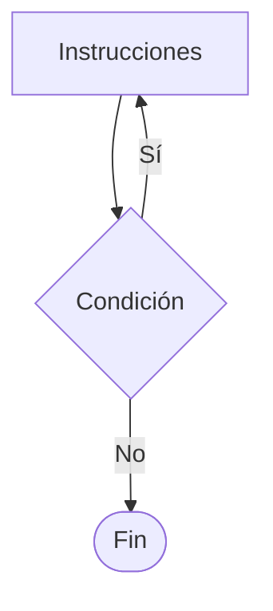
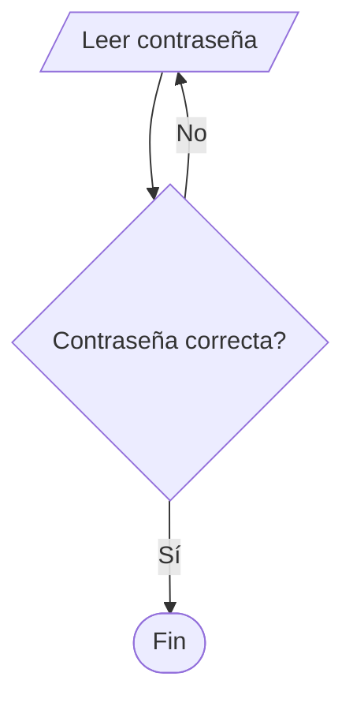

# Do While

## ¿Qué es Do While?

La estructura **Do While** es un ciclo que ejecuta un conjunto de instrucciones y posteriormente evalúa una condición para decidir si debe continuar repitiéndose.

A diferencia de While, la condición se evalúa al final del ciclo.

Por este motivo, el bloque de instrucciones se ejecuta al menos una vez.

---

# Importancia

El ciclo Do While permite:

* Garantizar una ejecución inicial.
* Construir menús interactivos.
* Validar entradas de usuario.
* Repetir procesos hasta cumplir una condición.

---

# Funcionamiento

El proceso sigue la siguiente lógica:

1. Ejecutar las instrucciones.
2. Evaluar la condición.
3. Si la condición es verdadera, repetir.
4. Si la condición es falsa, finalizar.

---

# Estructura general

## Pseudocódigo

```text
Hacer

    Instrucciones

Mientras condición
```

---

# Diagrama de flujo



---

# Diferencia con While

| Característica              | While | Do While |
| --------------------------- | ----- | -------- |
| Evalúa condición al inicio  | Sí    | No       |
| Evalúa condición al final   | No    | Sí       |
| Puede ejecutarse cero veces | Sí    | No       |
| Se ejecuta al menos una vez | No    | Sí       |

---

# Ejemplo conceptual

## Problema

Mostrar los números del 1 al 5.

### Pseudocódigo

```text
Inicio

    contador ← 1

    Hacer

        Mostrar contador

        contador ← contador + 1

    Mientras contador <= 5

Fin
```

---

# Prueba de escritorio

| Iteración | contador | Salida         |
| --------- | -------- | -------------- |
| 1         | 1        | 1              |
| 2         | 2        | 2              |
| 3         | 3        | 3              |
| 4         | 4        | 4              |
| 5         | 5        | 5              |
| Fin       | 6        | Sale del ciclo |

---

# Implementación en C++

## Sintaxis

```cpp
do {

    instrucciones;

} while (condicion);
```

---

# Ejemplo

```cpp
#include <iostream>

using namespace std;

int main() {

    int contador = 1;

    do {

        cout << contador << endl;

        contador++;

    } while (contador <= 5);

    return 0;
}
```

---

# Salida

```text
1
2
3
4
5
```

---

# Ejemplo de validación

## Problema

Solicitar una contraseña hasta que sea correcta.

### Pseudocódigo

```text
Inicio

    Hacer

        Leer contraseña

    Mientras contraseña <> "1234"

Fin
```

---

# Diagrama de flujo



---

# Ejemplo en C++

```cpp
#include <iostream>

using namespace std;

int main() {

    int clave;

    do {

        cout << "Ingrese la clave: ";
        cin >> clave;

    } while (clave != 1234);

    cout << "Acceso permitido" << endl;

    return 0;
}
```

---

# Aplicaciones

El ciclo Do While se utiliza en:

* Menús interactivos.
* Validación de contraseñas.
* Validación de datos.
* Juegos.
* Sistemas que requieren al menos una ejecución.

---

# Ventajas

| Ventaja                     | Descripción                                |
| --------------------------- | ------------------------------------------ |
| Garantiza ejecución inicial | Siempre se ejecuta una vez.                |
| Ideal para menús            | Permite mostrar opciones antes de evaluar. |
| Fácil de implementar        | Sintaxis sencilla.                         |

---

# Limitaciones

| Limitación                                                           | Descripción |
| -------------------------------------------------------------------- | ----------- |
| Puede generar ciclos infinitos.                                      |             |
| No siempre es apropiado cuando la ejecución inicial no debe ocurrir. |             |
| Menos utilizado que While y For.                                     |             |

---

# Ejemplo de ciclo infinito

```cpp
do {

    cout << "Hola";

} while (true);
```

Este ciclo nunca finaliza.

---

# Errores comunes

| Error                                         | Descripción                          |
| --------------------------------------------- | ------------------------------------ |
| Olvidar actualizar variables                  | Produce ciclos infinitos.            |
| Condición incorrecta                          | Resultados inesperados.              |
| Olvidar el punto y coma final                 | Error frecuente en C++.              |
| Utilizar Do While cuando debería usarse While | Puede ejecutar acciones no deseadas. |

---

# Información complementaria

Para comprender la teoría general de ciclos consulte:

* [Estructuras repetitivas](../04-repetitivas.md)

Para conocer el ciclo While consulte:

* [While](01-while.md)

Para comprender los operadores utilizados en las condiciones consulte:

* [Operadores básicos](../../Tema02_Datos/03-operadores_basicos.md)

---

# Conclusión

El ciclo Do While permite repetir instrucciones garantizando al menos una ejecución. Es especialmente útil para menús, validaciones y situaciones donde el proceso debe ejecutarse antes de evaluar la condición de continuidad.

---

# Resumen

| Concepto                 | Idea principal                            |
| ------------------------ | ----------------------------------------- |
| Do While                 | Evalúa la condición al final.             |
| Característica principal | Se ejecuta al menos una vez.              |
| Aplicación común         | Menús y validaciones.                     |
| Riesgo principal         | Ciclos infinitos.                         |
| Diferencia con While     | La evaluación ocurre después de ejecutar. |
